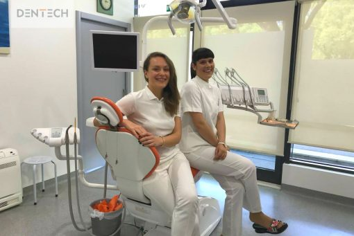

&nbsp;&nbsp;&nbsp;&nbsp;&nbsp;Bilo da je riječ o svakodnevnoj higijeni usne šupljine ili pak zahtjevnom kirurškom zahvatu, naši stomatolozi imaju odgovore na sva vaša pitanja. Pročitajte neke od njih u nastavku.

1. Koja je ispravna tehnika četkanja zubi? 
Ispravno četkanje zubi se izvodi blagim pokretima, te se četkica usmjeri prema desnima i lagano se povlači prema krajevima zubi. Kao da četkate kosu, od korijena prema vrhovima. Zapamtite, jaka četkica i podjednako jako četkanje nisu sinonim za temeljito pranje zubi.

2. Je li obavezna upotreba interdentalne četkice i zubnoga konca? 
Upotreba interdentalne četkice i zubnoga konca nije naravno obavezna, no svakako se preporučuje, kako bi se postigla optimalna čistoća usne šupljine i pri teško dostupnim mjestima za normalnu četkicu za zube.

3. Jesu li amalgamske (crne) plombe štetne i treba li ih mijenjati? 
Ovo je pitanje vrlo podvojeno, te neki će stomatolozi reći da nisu ako nemate nekakvih zdravstvenih problema. No, radi velike koncentracije metala (među ostalom i žive), definitivno se preventivno preporučuje mijenjanje istih u bijele plombe kako bi se izbjegli problemi.

4. Je li izbjeljivanje zubi štetno? 
Sredstva koja se u današnje vrijeme koriste za izbjeljivanje zubi jesu abrazivna sredstva, ali mala koncentracija peroksida koja se nalazi u gelu za izbjeljivanje neće znatno oštetiti vaše zube ako se pridržavate dobivenih uputa i takav tretman ne radite prečesto (ne više od 2x godišnje).

5. Može li se parodontitis izliječiti? 
Nažalost ne može. No, pravilnom se njegom može znatno usporiti povlačenje zubnoga mesa i spriječiti moguća upala. Posavjetujte se s vašim stomatologom kako bi vam mogao pružiti prave savjete za vašu situaciju.

6. Koliko traje ortodontska terapija aparatićem? 
Svaka ortodontska terapija ima drugačije trajanje, te ovisi o ‘veličini’ problema, dobi osobe, te subjektivnim fizičkim predispozicijama svakoga pacijenta. Inače traje od minimalno 6 mjeseci do par godina.

7. Odlučim li se za krunice ili ljuskice, je li brušenje zubi bolno? 
Brušenje se zubi izvodi pod lokalnom anestezijom kako bi se izbjegla nelagoda tijekom procedure, te nije uopće bolno. Svaki pacijent nakon brušenja dobije provizorne zube koji će zaštititi brušene bataljke do finalnog rada s krunicama.

8. Kada se zubi obruse, mogu li normalno funkcionirati s privremenim zubima? 
Materijal koji se koristi pri izradi provizornih zubi mekši je i tanji od same keramike koja će se kasnije fiksirati na zube, te se s toga preporučuje da pacijenti ne jedu tvrdu hranu, ne odgrizaju jako zalogaje, već da ih prstima otkinu i dobro prožvaču. No, ovo je samo kratak period koji vas vodi do vašeg savršenog osmijeha.

9. Je li kirurški zahvat s implantatima bolan? 
Kirurški zahvat umetanja implantata nije bolan zato što se izvodi pod lokalnom anestezijom. Osjećaj pritiska tijekom istoga je potpuno normalan, no prava bol ne postoji.

10. Svako koliko bih trebao/la dolaziti na stomatološke kontrole? 
Preporučuje se da odlazite na redovite stomatološke kontrole svakih 6 mjeseci, tj.dvaput godišnje. Tako ćete spriječiti sve probleme na vrijeme i imati uvijek situaciju ‘pod kontrolom’.

Javite nam se za bilo kakva pitanja na info@dentech.hr ili nas nazovite na 021/488-699.
Rado ćemo vam odgovoriti na sva pitanja i pružiti sve potrebne dodatne informacije.
 
Dentech – Ljepša strana osmijeha. 