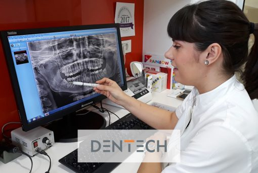

Umnjaci poznati kao osmice ili zubi mudrosti, rastu nakon svih ostalih zubi. Obično niču u periodu između 18. i 25. godine, tj. period kad bi čovjek trebao biti odrastao i smatra se zrelim ili „mudrim“, te otuda naziv „zubi mudrosti“. No, nerijetko se dogodi da umnjaci niču i kasnije, sve do 30. godine života. Oni niču posljednji u zubnom luku, te kao takvi se nalaze na poziciji br.8, pa otuda i popularni naziv „osmice“.

Tijekom evolucijskog razvoja došlo je do smanjenja čeljusti dok je veličina zubi ostala ista. Stoga, zbog njihovog kasnijeg nicanja često nemaju dovoljno mjesta za pravilan rast. Kod nekih osoba neće ni niknuti, dok će kod nekih izbiti u krivom smjeru. Zbog toga sve češće nailazimo na problem impaktiranih i retiniranih umnjaka.

1. Koji su najčešći problemi s umnjacima?
Tri najčešća problema koja se javljaju s umnjacima su otežano nicanje, karijes, impaktirani ili semiimpaktirani umnjaci.

Kod otežanog nicanja zubi, osim boli javlja se crvenilo, oteklina, ponekad i nemogućnost otvaranja usta, a u nekim slučajevima i povišena temperatura. U težim slučajevima može se pojaviti i jaka glavobolja, otok limfnih čvorova, bol u uhu, te nemogućnost pomicanja vrata.

Impaktirani (neizrasli zubi) su oni koji su potpuno formirani u kosti, no nisu izrasli izvan zubnog luka. Potpuno impaktiran zub uglavnom ne stvara nikakve probleme, ali ako se oko njega stvori folikularna cista u tom slučaju ga treba izvaditi.

Semiipaktirani umnjaci (djelomično izrasli zubi) su problematičniji, jer su podložni čestim upalama i smješteni na teško vidljivom mjestu, te u većini slučajeva dolazi do potrebe za vađenjem.

Kada karijes nastane na potpuno izniknulom umnjaku, njega je relativno lako izliječiti. Međutim, kod djelomičnog nicanja ili nepravilnog položaja, umnjak je teže ili nemoguće popraviti, što vodi također do njegovog vađenja.

2. Kako se pripremiti za zahvat vađenja umnjaka?
Prije vađenja od iznimne je važnosti napraviti detaljnu predoperativnu anamnezu. Mi u Dentechu, bez reda čekanja možemo napraviti RTG ili CT snimak zuba koji jasno pokaziva u kojem su položaju zubi. Naši iskusni stručnjaci će obaviti i detaljan pregled te preporučiti najbolju terapiju.

3. Vađenje umnjaka – postupak?
U Dentechu, vađenje umnjaka je rutinski postupak, koji obavlja stručni oralni kirurg. Postupak se izvodi pod lokalnom anestezijom, te nije ništa strašniji od normalnog vađenja zuba. Postoje različite vrste rezova, a izbor ovisi o položaju i dubini impaktiranog umnjaka. Rana se na kraju šiva minimalnim brojem šavova koji se skidaju nakon tjedan dana.

4. Oporavak nakon vađenja umnjaka?
Vrijeme oporavka ovisi o težini kirurškog zahvata koji je izveden, te individualnim regenerativnim sposobnostima vašeg organizma. U većini slučajeva, svakodnevnim i poslovnim aktivnostima možete se vratiti nakon 2 do 4 dana, ali u nekim slučajevima oporavak može trajati i duže. No, kako bi izbjegli ili barem smanjili post-operativnu nelagodu bitno je pridržavati se uputa koje ćete dobiti od vašeg doktora ili u nekim slučajevima uzimati propisane analgetike.

5. Korisni savjeti naše Dr. Mije:
Najtoplije preporučujem da se prije zahvata dobro naspavate i odmorite. Naime, pacijenti koji su odmorniji manje su razdražljivi i osjetljivi. U prvim satima nakon vađenja preporučujem mirovanje i ležanje na povišenom položaju. Također, nekoliko sati poslije operacije, barem 2-3 sata, suzdržite se od hrane.

Nakon toga konzumirajte hranu koja neće otvoriti ranu i izazivati bolove kada jedete. Bitno je da ne jedete vruću i prezačinjenu hranu, ne upotrebljavajte slamku jer pri sisanju možete povećati krvarenje, nemojte piti alkohol i gazirana pića, te ne pušite. Ranu nemojte ispirati barem 24 h nakon vađenja.

Također preporučujem:

na vanjskoj strani obraza držati hladan oblog (po 10-ak minuta).
izbjegavati trljanje mjesta gdje je zub izvađen jezikom i dodirivanje rukama.
nakon 24 h sata od vađenja, isperite zube mlakom vodom u kojoj ste otopili žlicu soli, ili mlakim čajem od kadulje. Higijena u postoperativnom razdoblju je veoma bitna, stoga zube četkajte kao i obično, ali izbjegavajte područje oko izvađenog zuba.
Ipak, najvažnije je da znate da je vađenje umnjaka siguran i bezbolan zahvat koji ne traje dugo. U stručnim rukama našeg oralnog kirurga i potpuno opremljenoj klinici, osjećat ćete se sigurno.

Radujemo se vašem posjetu! 