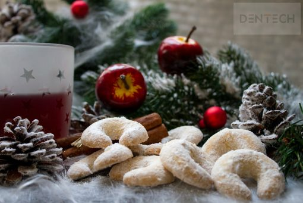

Vrijeme adventa nekima je najdraži period u godini.

To je period kada uživamo u društvu nama najmilijih ali i kada uživamo u ukusima raznovrsnih blagdanskih poslastica. Nije neuobičajeno da tada jedemo više nego što smo navikli, te ćemo si oprostiti koju slasticu i više. Iako štetne za zdravlje zubi, blagdanske slastice (kolači, torte, medenjaci…) su nam omiljena hrana kojoj se s nestrpljenjem radujemo.

Prema smjernicama svjetske zdravstvene organizacije (WHO) preporučeni unos šećera je 5% od sveukupnog dnevnog unosa kalorija. Budući da za blagdane svi jedemo više nego uobičajeno, možemo se zapitati: **Koliko šećera pojedemo za vrijeme blagdana?!**

Prije nego svom organizmu priuštite prekomjerni unos omiljenih slastica, preporučujemo da razmislite o posljedicama. Naime, velike količine šećera izravno utječu na stvaranje karijesa koji predstavlja izravnu prijetnju za zdravlje zubi, ali i druge zdravstvene tegobe.

Konzumacija šećera potiče nastanak **karijesa**, odnosno rafinirani ugljikohidrati hrane bakterije u ustima te proizvode kiselinu koja uništava zaštitne minerale na površini zuba. Stvaranje karijesa i oštećenje koje će posljedično tome nastati, ovisi o količini i načinu na koji konzumiramo slastice. Zato je umjerena konzumacija te dobra i **redovna oralna higijena** najbolja prevencija za njegov nastanak. No, ako je već došlo do karijesa, potrebno je obvezno dogovoriti posjet kod stomatologa, koji će izliječiti vaš zub. Ako se ne liječi, karijes može dovesti do uništenja zuba, infekcije, a samim time i do njegovog vađenja.

U tom slučaju pretjerana konzumacija šećera može uzrokovati potrebu za:

* zubnim plombama
* liječenje bolesti zubne pulpe
* zubnim mostovima
* zubnim implantatima.

Svjesni smo da su tradicionalni blagdanski objedi nešto što spaja mnoge obitelji, jer tada zaboravimo na sve druge obveze i posvetimo svoje vrijeme druženju s najmilijima. Stoga, ne savjetujemo vam da ih treba izbjegavati, nego samo malo pripaziti na unos šećera. Također je bitno znati kako zaštiti zube u takvim prilikama.

Zato smo pripremili par savjeta za vas, kako bi uživali u prazničkom raspoloženju uz zdrav i bijeli osmijeh:

* Tijekom blagdana obvezna je oralna higijena koja podrazumijeva redovito i temeljito četkanje (minimalno dva puta dnevno) sa zubnom pastom i korištenje zubnog konca.
* Zube bi trebalo prati poslije svake konzumacije hrane i pića koji sadrže šećere. Važno je znati da pranje zubi ne bi trebalo biti odmah nakon obroka, nego pola sata kasnije. Naime, odmah nakon obroka zbog povišene kiselosti zubna caklina je iznimno osjetljiva pa se četkanje treba izbjegavati kako ne bi došlo do oštećenja.
* Ako već pijemo gazirane sokove, umjetno zaslađene ali i prirodno iscijeđene sokove, preporučujemo brzo ispijanje za razliku od “gutljaj po gutljaj”. Na ovaj način i dalje unosimo kalorije ali manje štetno za zubne.
* Odlučite se na ograničen broj obroka, za razliku od stalnog grickanja. Naime pri stalnom grickanju, u ustima se stvara manje sline koja čisti zube nego kod cjelovitog obroka.
* Izbjegavajte slastice koje se lijepe za površinu zubi.
* Poslije ukusnih slastica, preporučujemo da jedete sir kako bi neutralizirali štetne kiseline u ustima.
* Zadnja ali i najvažnija preporuka: Poslije blagdana pozivamo vas na potpuno besplatni pregled na kojemu ćemo provjeriti stanje vaših zubi i ponuditi najbolju njegu za njihov oporavak.

Želimo vam ugodne i ukusne blagdane!