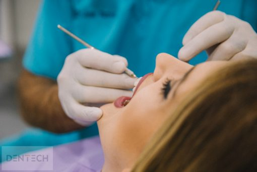

Istraživanja pokazuju da je potrebno samo sedam sekundi pri stvaranju prvog dojma o nekome. Budući da je osmijeh prvo što primijetimo kod ljudi, on ima veliku ulogu u stvaranju pozitivne slike o nama.

`Ništa tako moćno, tako snažno ne otkriva čovjekovu narav kao smijeh.`– Johann Wolfgang Goethe

Gubitak zuba narušava izgled našeg osmijeha i dovodi do gubitka samopouzdanja. Osim toga, gubitak već samo jednog zuba utječe na prehrambene navike, govor i žvakanje, te smanjuje kvalitetu života. S obzirom na važnost lijepog i zdravog osmijeha u našem životu, izgubljeni zub potrebno je odmah nadoknaditi kako ne bi došlo do daljnjih komplikacija.

Najčešće pitanje koje si u tom slučaju naši pacijenti postavljaju je: Kada odabrati zubni implantat, kada krunicu, a kada most?

Moderna stomatologija nudi mnoga rješenja. Naši stručnjaci u Dentech-u koriste najnovija rješenja iz svijeta fiksne i mobilne protetike (zubne proteze, implantati, krunice, mostovi) kako bi pacijentima vratili zdrav i blistav osmijeh.

Zbog svoje trajnosti i činjenice da u potpunosti vraćaju funkcije prirodnih zubi, implantati i zubni mostovi su najčešće rješenje iz područja fiksne protetike za nadomjestak izgubljenog zuba.

Zubni most je fiksni protetski nadomjestak od dvije ili više zubnih krunica koji se izrađuje kako bi se nadoknadio jedan ili više zubi. Izrađuju se na metalnoj konstrukciji ili na konstrukciji cirkonijevog oksida, koje se oblažu keramikom u bijeloj boji. Za ugradnju zubnog mosta u modernoj stomatologiji se koristi lokalna anestezija, stoga je postupak potpuno bezbolan.

Implantat je titanski vijak koji se manjim kirurškim zahvatom ugrađuje u čeljust. Ugradnja se izvodi u kontroliranom ambijentu s lokalnom anestezijom i u potpunosti je bezbolna. Kada je koštano tkivo sraslo s implantatom, implantat je spreman za postavljanje nadogradnje (titanska ili cirkonska) za kasniji zubni nadomjestak (krunice, mostovi ili planiranje zubne proteze na implantatima), čime pacijent konačno dobiva funkcionalne, kvalitetne i lijepe zube. Istraživanja dokazuju da su zubni implantati rješenje koje najduže traje, pruža prirodan izgled i najbolja zamjena za prirodne zube.

Kada se preporučuje zubni most?
Preporučujemo zubni most u situaciji kada nedostaje više zubi u nizu i kada zubi koji bi trebali biti nosači budućeg mosta imaju velike ispune i liječene korijenske kanale. Zubni most se može preporučiti i onda kada su zubi već prethodno brušeni (kada je pacijent već imao zubni most) i onda kada nemamo velike bezube prostore, te možemo vezati most.

Kada se koristi metal keramika, a kada cirkon?
Metal keramički zubni most u bazi ima metal na koji se veže keramika, te ga odlikuje čvrstoća i izuzetna trajnost, stoga se često koristi kod velikih bezubih prostora.

Cirkon keramika izvrsno oponaša prirodnu boju zubi, dobro prenosi prirodnu svjetlost, te je odličan izbor za prednje zube.

Metal keramički i cirkon keramički mostovi funkcijski imaju jednaka svojstva. Koju vrstu zubnog mosta koristiti ovisi o estetskim karakteristikama koje želimo postići.

Ako pacijent ima problem isključivo estetske prirode, a nije kandidat za zubne ljuskice, za poboljšanje svog izgleda preporučiti ćemo cirkon keramički most. Blistavo bijeli osmijeh koji imaju poznate zvijezde sa reklama više nije nedostižan. Uz modernu tehnologiju i vrhunsku estetiku cirkonskih materijala, “Hoolywoodski osmijeh” više nije izuzetak nego prihvaćeni standard.

Kada se preporučuju implantati?
Ako pacijentu nedostaje samo jedan zub, idealno rješenje je ugradnja implantata budući da ne zahtijeva brušenje susjednih zdravih zubi. Također se preporučuju kada jednostavno nema dovoljno prirodnih zubi na koje bi mogli vezati most, stoga nam implantati služe kao nosači mosta.

Tko izvodi ugradnju implantata?
U Dentech ordinaciji ugradnju implantata izvodi specijalist oralne kirurgije s dugogodišnjim iskustvom u implantologiji.

Koliko traje postupak ugradnje implantata?
Sam zahvat ugradnje implantata traje od oko 10-15 min po implantatu. Ugradnja implantata se u većini slučajeva izvodi u samo jednom dolasku. Nakon ugradnje implantata slijedi određeni period oporavka od 3-6 mjeseci, a u međuvremenu pacijent dobije provizorne zube, tako da zahvat ne utječe na oralne funkcije u procesu oporavka. Kada je koštano tkivo sraslo s implantatom, implantat je spreman za postavljanje nadogradnje za kasniji zubni nadomjestak (krunice ili mostovi na implantatima ili planiranje zubne proteze na implantatima) čime pacijent konačno dobiva funkcionalne, kvalitetne i lijepe zube.

Koji implantat odabrati?
Naš tim koristi samo provjerene i kvalitetne zubne implantate kao što su Implant Direct i Nobel Biocare. Cijene implantata kreću se već od 3500 kn po implantatu. Našim pacijentima nudimo doživotnu garanciju na ugrađeni implantat.

Treba li odlaziti na preglede nakon ugradnje zubnog implantata i izrade zubnog mosta?
Nakon ugradnje zubnih implantata i izrade mosta, pacijentima pružamo savjete za postoperativnu njegu i podršku naših liječnika. Tako se pacijenti mogu osjećati sigurno i zadovoljno sa svojim novim osmijehom. Pravilno održavanje oralne higijene uključuje redovito četkanje zuba, redoviti pregled kod stomatologa i profesionalno uklanjanje zubnog kamenca.

Svaka od gore navedenih opcija za nadomjestak zuba je učinkovita, no pri odabiru najboljeg rješenja treba uzeti u obzir opće zdravstveno stanje pacijenta i stanje usne šupljine, napraviti za početak CBCT snimak te na temelju toga napraviti plan terapije.

Za pomoć pri odabiru najboljeg rješenja slobodno nam se javite i rezervirajte besplatan pregled i konzultacije. Možete rezervirati svoj termin na broj +385 21 571 568 ili poslati email na info@dentech.hr .

Radujemo se Vašem posjetu! 