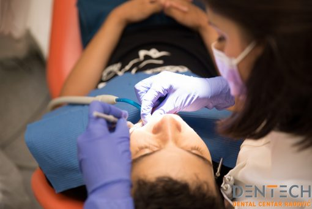

Plombe ili ispuni koriste se za **sprječavanje širenja karijesa do živca u zubu** i nastajanje većih problema. Plombe se koriste i kod deformacija oblika zuba, u slučaju ako se dio zuba odlomio ili ako se neki zub potrošio.

Jeste li zabrinuti za stanje vaših zubi? Osjećate li možda **rupice ili šupljine u zubu**? Bole li vas zubi prilikom četkanja? Jesu li vam zubi osjetljivi na toplo, hladno ili slatko?

Ako se prepoznajete u svemu navedenom, postoji mogućnost da vaši zubi nisu u najboljem stanju te da propadaju, što zahtijeva ispunjavanje zuba namjenskim zubnim plombama.

U nastavku teksta upoznat ćemo vas s plombama, odnosno restaurativnim materijalima koji služe za **vraćanje funkcije i estetskog izgleda zuba**. Govorimo o razvoju zubnih plombi te podjeli plombi prema tipu zahvaćenosti karijesom. Zatim, plombe se dijele na bijele (kompozitne) i na crne (amalgamske) te navodimo prednosti jednih i drugih.

Općenito govorimo o značajkama plombiranja te o prevenciji zaštite postojećih plombi.

* Plombe
* Razvoj zubnih plombi
* Vrste plombi prema tipu zahvaćenosti karijesom
* Sanacija karijesa plombama
* Značajke plombiranja
* Bijele plombe
* Crne plombe
* Prevencija zaštite postojećih plombi

###Plombe
Popravak zubi plombama **najčešći je stomatološki zadatak**. Ispunima se spašava živac zuba na način da se očisti karijes i ispuni novonastala šupljina.

Za plombe se koriste restaurativni materijali koji pomažu obnoviti funkciju zuba te nadoknaditi njegovu izgubljenu strukturu. Zubi se uglavnom uništavaju i oštećuju zbog nastanka karijesa. Hrana koja uslijed neredovite i nepravilne oralne higijene ostane zaglavljena na četkici nedostupnim mjestima, aktivira bakterije u ustima koje stvaraju kiseline.

Kombinacija ostataka hrane, bakterija i kiseline predstavlja idealne uvjete za nastanak plaka koji prianja na zubnu površinu i polako uništava zubnu caklinu. Propadanje zubne cakline dalje uzrokuje nastanak šupljina u zubima koje je potrebno sanirati plombom.

###Razvoj zubnih plombi
Prve plombe bile su tamne boje zbog čega se danas sve rjeđe koriste. Njihova boja dolazi od materijala od kojeg su napravljene – kositar, srebro ili bakar. S obzirom na to da im je najveći nedostatak estetski, zamijenile su ih bijele plombe. Takve bijele ispune najčešće su danas jer bolje zadovoljavaju kriterij estetike, a ujedno su kvalitetne.

Zahvaljujući napretku znanstvene stomatologije, moguće su različite kombinacije materijala takvih ispuna te velik broj nijansi kako bi boja ispune što bolje odgovarala prirodnoj boji zuba.

Zahvaljujući tome, poklapanje tih boja toliko je blisko ga je gotovo teško uvidjeti je li zub zdrav ili popravljan, što zapravo apsolutno odgovara svim pravilima estetske stomatologije. Njihova jedina negativnost je ta što bijela ispuna pod utjecajem nikotina, kofeina i obojenih namirnica može promijeniti boju.

###Vrste plombi prema tipu zahvaćenosti karijesom
Zub je, naravno, trodimenzionalno tijelo kojeg, gledano iz stomatološkog kuta, čini više ploha. Karijes tako može zahvatiti gornju plohu zuba, dakle zagriznu površinu. Tada stomatolog sanira karijes kao jednoplošnu plombu.

Ako je karijes, osim gornje plohe, zahvatio i jednu od ploha uz susjedne zube tada je riječ o dvoplošnoj ispuni. A najsloženija sanacija zuba zahvaćenog karijesom je ona u kojoj je karijes zahvatio gornju plohu te obje plohe susjednih zubi. Tada se radi o troplošnoj plombi.

###Sanacija karijesa plombama
Najčešći stomatološki zahvat kojim se sanira zubni karijes upravo je plombiranje zubi. Nakon što zubni karijes zahvati zdravi zub, stomatolog mora sanirati nastalu štetu prije nego što se karijes nastavi razvijati i uništi zub. Dio zuba koji je zahvaćen karijesom potrebno je izbrusiti sve do zubnog tkiva koje je zdravo.

Prostor koji je izbušen pri čišćenju od karijesa potrebno je popuniti kako novi ostaci hrane ne bi tu zaostajali i potencirali nastanak novog karijesa. Upravo to punjenje naziva se ispuna ili plomba. To ujedno znači da stomatolog zaštićuje zubni živac od prodora karijesa do njega. U slučajevima kada do toga dođe, šteta na zubu je drastično veća.

###Značajke plombiranja
Prilikom stavljanja ispune u šupljinu zuba, važno je da ona bude svojom gornjom površinom identična površini nekadašnjeg zuba. To je vrlo bitna stavka oblikovanja ispune jer u suprotnom sklad s drugom čeljusti, odnosno njezinim zubima, neće biti odgovarajući. To se lako provjerava pri zagrizu pacijenta.

U koliko on osjeti smetnju pri zagrizu to označava da zagriz nije idealan pa višak materijala ispune treba ukloniti i prilagoditi.

U slučaju da stomatolog ne obrati dovoljno pažnje na to, sigurno je da će višak plombe vršiti pritisak na suprotan zub pri svakom zagrizu. Čime se javlja bolnost oba zuba ili čak cijele čeljusti. Osim toga, plombu je potrebno dobro ispolirati kako njezina površina ne bi ostala hrapava. Hrapavost površine na mikroskopskoj razini znači izrazito male pukotine koje mogu poslužiti kao idealna mjesta za zadržavanje bakterija i nastanak novih problema.

###Bijele plombe
Bijele plombe odnosno kompozitni estetski ispuni odnose se na zubne plombe koje obnavljaju zub istovremeno oponašajući **prirodni izgled strukture zuba**. Riječ je o izvrsnom sredstvo za rekonstrukciju zuba zbog adhezije (lijepljenja) na zubnu površinu.

Snaga lijepljenja je toliko jaka da u slučaju eventualnog puknuća zuba, ispun ostaje čitav.
Estetski ispuni osim što se koriste za obnavljanje napuklih ili propalih zuba, mogu se upotrebljavati u kozmetičke svrhe kako bi se promijenila veličina zuba, boja i njihov oblik. Sve se više ljudi odlučuje na popravljanje otkrhnutih zubi uz pomoć estetskih ispuna, ali i na postizanje ujednačenog i ravnijeg izgleda zuba.

####Bijele plombe – prednosti
Ovi ispuni kemijski povezuju se sa strukturom zuba te iz tog razloga ne zahtijevaju umetanje utora, žljebova i klinova kako bi se mehanički zadržali. Ne postoji prevelika osjetljivost zubi kod stavljanja ispuna, već je riječ o minimalnoj i kratkoj osjetljivosti zbog adhezije koja se koristi.

Prednost bijelih ispuna je i ta što se jednako mogu koristiti kako na prednjim tako i na stražnjim zubima te nemaju nikakav utjecajna estetiku. **Potpuno očvrsnu već unutar par sekundi**, a u slučaju da se oštete vrlo se lako mogu popraviti. Još jedna prednost bijelih plombi je ta da je potrebno izbrusiti puno manji dio zdravog zuba, nego što je to u slučaju s crnim (amalgamskim) ispunima.

**Bijele plombe kemijski se vežu sa zubima**, stoga njihovo postavljanje ne zahtijeva uvijek da se anestezira područje koje se popravlja. Kada se ukloni kvar zuba, nanese se blaga kiselina na područje koje se popravlja, jer će ona otvoriti pore na caklini i na dentinu. Nakon toga izlijeva se sredstvo za povezivanje u otvorene pore gdje se stvrdnjava.

Prilikom stvrdnjavanja sredstvo za povezivanje priprema se za vezivanje s bijelom plombom koja se nakon toga postavlja. Plomba se oblikuje da odgovara prirodnom obliku zuba, nakon čega se osvjetljava snažnim svjetlom kako bi očvrsnula. Stomatolog zatim provjerava zagriz kako bi bio siguran da su zubi pravilno i ispravno posloženi. Nakon toga, plomba se mora još dodatno zagladiti i ispolirati.

###Crne plombe
Crne plombe jesu amalgamske plombe, a zubni amalgam napravljen je od kombinacije žive, srebra, bakra i kositra. Ovaj zubni materijal je dugotrajan i povoljniji od kompozitnih ispuna. Izdržljiv je, jednostavan za upotrebu, otporan na habanje i relativno jeftin u odnosu na ostale materijale.

**Amalgamske plombe** su do nedavno bili najkorištenije plombe za popravljanje zuba. Prvi pisani podaci o ispunjavanju zubi sličnim sastavom nalazimo u 16. stoljeću, dok su u SAD – u amalgamske plombe uvedene tek u 19. stoljeću.

S obzirom na njihov sastav konstantno se radilo na poboljšavanju ovog dentalnog amalgama kako bi se smanjile njegove loše karakteristike. S vremenom počeli su se izrađivati amalgami s **visokim udjelom bakra**. Na taj se način poboljšala kvaliteta ovakvih ispuna jer su povećane njegove mehaničke karakteristike.

S obzirom na to da je iznimno je trajan, iz tog razloga je amalgam najbolji odabir za popunjavanje velikih šupljina, osobito onih koje su nastale na stražnjim zubima. **Crna plomba ne izgleda ni malo prirodno**, pogotovo ne na prednjim zubima koji u skoro svakoj situaciji mogu biti vidljivi.Za njihovo postavljanje odnosno ispunjavanje zuba potrebno je manje vremena i kao što smo ranije naveli, dosta su jeftiniji od bilo kojeg drugog restaurativnog stomatološkog materijala.

No, za popunjavanje zubne šupljine amalgamom stomatolog mora ukloniti puno više zubne strukture nego što je to potrebno prilikom postavljanja bijelih ispuna.Iako je amalgam siguran i dobar te trajan izbor za stomatološke ispune, u današnje se vrijeme najčešće koriste kompozitni ispuni, jer postoje različite vrste materijala te veliki broj različitih nijansi boja kako bi se postigla što sličnija prirodna boja zuba. Ipak, preporučujemo vam da se savjetujete s vašim stomatologom koji će vas uputiti u sve što vas zanima.

###Prevencija zaštite postojećih plombi
Pri svakoj redovitoj kontroli kod vašeg stomatologa važno je da se pregledaju već liječeni zubi. Iako vam je stomatolog sanirao zubni karijes to ne znači da se na njegovoj plombi ne može pojaviti i razvijati novi karijes. U tom slučaju stare je ispune potrebno ponovno ispuniti novim plombama.

Plombe pomažu u obnavljanju zubne strukture te vraćaju zubu njegovu uobičajenu funkciju i, dakako, **estetski izgled**. Njima se uklanjaju odnosno popunjavaju rupe u zubima uzrokovane trošenjem i propadanjem zuba. Ujedno, osigurava se zdravlje zubi i vraća im se njihova glavna funkcija.

Ako osjetite bol u zubu ili ste napipali neku šupljinu, obratite se svom stomatologu u što kraćem roku kako bi se sanirao zub bez većih problema i neželjenih posljedica.