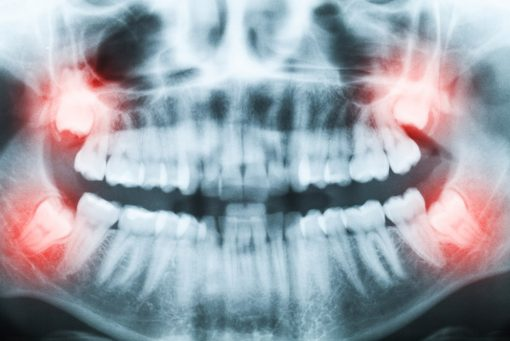

Zubni se rendgen sve češće koristi u stomatologiji, a obavlja se pomoću RTG uređaja. Snimka koja proizlazi iz zubnog rendgena pomaže stomatolozima da dobiju uvid u zdravstveno stanje usne šupljine pacijenta. Rendgenske su snimke, dakle, metode kojima stomatolozi vrlo lako mogu postaviti točnu dijagnozu pacijenta, budući da se zubnim rendgenom pruža uvid u stanje struktura u usnoj šupljini koje običnim kliničkim pregledom nisu vidljive. Napredak tehnologije prisutan je i kod zubnog rendgena, jer se danas oni uglavnom obavljaju digitalnim putem.

Digitalna tehnologija omogućuje stvaranje preciznih i kvalitetnih zubnih snimaka, uz veoma malenu količinu zračenja. Za obavljanje željenih pretraga potrebno je minimalno izlaganje ionizirajućem zračenju. Pritom se koriste superosjetljivi senzori i posebni algoritmi kojima se smanjila količina zračenja koja je prije bila potrebna za ovakve situacije. Zubni rendgen rezultira rendgenskom snimkom na kojoj se mogu uočiti promjene na zubima i kosti, odnosno na tvrdim tkivima. Promjene u kosti na snimci se vide kao prosvjetljenja, jer se na mjestu upale smanjuje gustoća kosti. Zubni se karijes vidi kao prosvjetljenje na kruni zuba. Rendgenska snimka pokazuje i umjetne materijale od kojih su se izrađivali ispuni, krunice, mostovi i sl. Danas se najčešće koristi ortopantomogram ili ortopan. Riječ je o snimci koja ne samo da obuhvaća sve zube iz donje i gornje čeljusti već i okolne strukture i čeljusni zglob. Za ortopanom se poseže u slučajevima kada je potrebno dobiti uvid u sve zube i njihove okolne koštane strukture.

Danas je uz pomoć digitalne tehnologije moguće načiniti ortopan u digitalnom formatu. Tada je riječ o digitalnom ortopanu. Visokokvalitetna digitalna snimka prikladna je za prikazivanje na računalu. Digitalni ortopan se tada može prikazivati u veličinama koje odgovaraju stomatologu. Prednosti digitalnog ortopana su mogućnosti izrađivanja sigurnosnih kopija te dodatno digitalno obrađivanje snimaka. Imaju i visoku preciznost svih prikazanih struktura, a to omogućuje bolju dijagnostičku primjenu jer stomatolozi tako mogu uočiti više detalja. Najbolja geometrija snimanja prikazuje precizan i neiskrivljen prikaz svih zuba gornje i donje čeljusti. Ortopanom se mogu jasno uočiti patološki procesi prisutni oko korijena zubi te karijesne lezije na zubima. U slučaju da pacijent boluje od parodontitisa digitalni ortopan idealan je za uvid u stanje kosti. Digitalni ortopan kao osnovna stomatološka dijagnostička metoda često se izrađuje kao orijentacijska snimka pri prvom pregledu usne šupljine pacijenta. Ovakvu snimku obavezno je načiniti u slučaju planiranja protetske terapije ili kod primjene ortodontskih pomagala. Za vađenje neizniklih zubi ili kod planiranja postavljanja implantata također je potrebno napraviti digitalni ortopan kako bi stomatolog u potpunosti dobio uvid u stanje svih zuba i koštanih struktura. Na ortopanu se najlakše može vidjeti je li formiran umnjak, koliko je sazrio i sl. Digitalni ortopan pokazuje stanje i kvalitetu kosti te ima li u njoj dovoljno mjesta za ugradnju implantata.
Digitalni ortopan najvažnija je snimka za postavljanje točne dijagnoze jer utječe na pravovremeno otkrivanje bolesti zuba i okolnih struktura te na primjenu odgovarajuće terapije. Svi rendgeni podrazumijevaju izloženost određenoj količini zračenja, no zahvaljujući napretku digitalne tehnologije, danas je ono svedeno na minimum. Usprkos tome, ne preporučuje se izbjegavanje zubnog rendgena jer na vrijeme neuočene nepravilnosti i oboljenja mogu uzrokovati veće probleme.