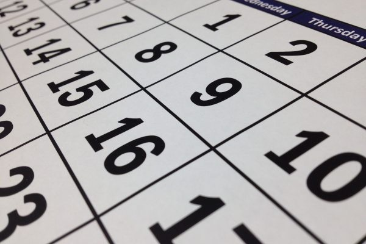

Dragi naši nažalost, novonastala situacija u zemlji i svijetu, ne posustaje.

Svjesni smo da je najvažnije zdravlje, vaše, naše ali i onih najugroženijih skupina kao što su stariji ljudi i osobe narušenog imuniteta.

U želji da zaštitimo jedni druge, i da pošaljemo jasnu i glasnu poruku, pozivamo vas da ostanete kod kuće. Ako vas zub NE boli, otkažite svoj termin.

Bit će vremena i za čišćenje kamenca, i za izbjeljivanje, i za aparatiće, krunice, ljuskice, implantate… Ali sada nije to vrijeme. Sada je vrijeme da svoje osobne potrebe stavimo sa strane i da budemo na usluzi jedni drugima. Ne želimo da se i u Hrvatskoj ponovi Italija. Pratili smo vijesti na televiziji, i svi nam mediji uporno govore iste 3 riječi: ostanite kod kuće!

Naša ordinacija bit će otvorena isključivo za hitne slučajeve. Molimo vas da prije vašeg dolaska nazovete 00 385 99 482 7567 i da se sa sestrom dogovorite oko termina. Ne želimo gužvu u ordinaciji.Nadamo se, baš kao i svi, da će sve ovo brzo proći.

Budite mudri, odgodite kavu, odgodite zubara, odgodite sve ono što se odgoditi da i #OstaniteKodKuće!

Čuvajte se!
Vaš Dentech
