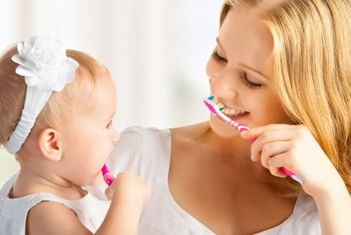

Djeca svoj prvi zub dobiju u prosjeku sa 6 mjeseci, a ovaj proces nicanja mliječnih zubi traje sve do njihove 3.godine. Ova je faza često mučna za bebe, iz razloga što osjećaju nelagodu i svrab pri nicanju, te stalno imaju potrebu grickati sve i svih.

Simptomi nicanja zubi mogu se ublažiti sa posebnim gelovima koje možete pronaći u bilo kojoj apoteci, a hlade i umiruju zubno meso. Također, pomoći će ‘igračke žvakalice’, jer one sadrže posebnu tekućinu koja se u hladnjaku ohladi i tako ublažava djetetu svrab. Hladnoća će smiriti iritirano područje, a djetetu će misli zaokupiti igra.

Briga o usnoj šupljini počinje već sa prvim zubićem, te je neophodno da vaše dijete učite, od malih nogu, kako izgleda pravilna njega. Znamo da sve to možda zvuči preozbiljno za jedan ili par mliječnih zubića, no ovakve će pozitivne navike olakšati kasniju brigu o trajnim zubima, a samim time i svesti na minimum bilo kakve stomatološke probleme.

Mi u Detechu želimo stvoriti, od samog početka, odnos povjerenja između najmlađih pacijenata i naših vrijednih stomatologa. Kada se povjerenje stekne od malih nogu, vjerujemo da će stereotipi vezani za ‘strašne i opasne zubare’ ubrzo nestati. Odlazak zubaru ne mora biti ni stresan ni traumatičan!

Igra je ključ svega. Vaše će dijete s puno više veselja prihvatiti pranje zubića budete li kroz igru uvodili ovu naviku. Stavite mu mali stolac ispod umivaonika i četkicu na vidljivom mjestu, njemu će biti zanimljivo što može kao ‘veliki’ oprati svoje zube. Naravno, prvo ćete mu vrijeme morati pomoći dok ne usvoji držanje četkice i način četkanja, no uz ustrajanost brzo će se ovakva navika pretvoriti u rutinu.

Osim redovitih stomatoloških kontrola, za zdrave je zube izrazito bitna i prehrana vaše djece. Izbjegavajte hranu koja sadrži umjetne šećere, a to su u prvom redu slatkiši, gazirana pića i sokovi. Pravilna prehrana pozitivno utječe ne samo na zdravlje usne šupljine vašeg djeteta, već i na sveukupno zdravlje njegovog malog organizma u razvoju.

Odlaskom kod zubara u ranijoj dobi možete spriječiti ne samo ‘klasične’ stomatološke probleme kao što je karijes, već ćete vrlo rano moći pratiti razvoj čeljusti vašega djeteta i vaš će stomatolog na vrijeme moći uočiti moguće nepravilnosti. Ranim otkrivanjem takvih nepravilnosti imate mogućnost spriječiti neke veće probleme koji bi se mogli javiti u budućnosti.

Jeste li i dalje među onima koji smatraju da briga o mliječnim zubićima nije ništa posebno, jer ‘ionako će ispasti’? Nadamo se da smo vam pomogli shvatiti da to zapravo nije tako.

Dentech tim vas poziva da se za bilo kakve informacije javite na 021/488-699 ili putem naše email adrese info@dentech.hr .

Vaš Dentech!