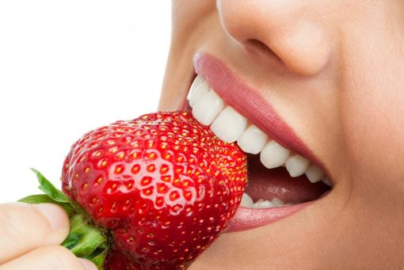

Bezbroj ste puta dosad pokušali otkloniti mrlje sa vaših zubi i postići toliko željeni blistavi osmijeh? Jeste li postigli željene rezultate?

Osim što svatko od nas mora voditi brigu o vlastitoj oralnoj higijeni i zdravlju, te odlaziti na redovite stomatološke kontrole i odstranjivanje kamenca barem jednom svakih šest mjeseci, za vaše je zube bitno i što konzumirate. Svaka namirnica ili piće koje unosimo ima određeni kemijski sastav, a baš taj kemijski sastav utječe na pojavu ili nestanak mrlja na zubima i žutila.

Svima je već poznato što najviše šteti boju vaših zubi (cigarete, gazirana pića, alkohol, bobičasto voće, i nažalost nama najdraža – kava ), no postoje i namirnice koje mogu pomoći u održavanju bjeline vaših zubi, a mi smo za vas izabrali 5 najukusnijih.

1. TAMNA ČOKOLADA
Da znamo, strašno ste iznenađeni što je upravo ova namirnica na prvome mjestu. No, rekli smo da ćemo vam predložiti one najukusnije, a tamna se čokolada svakako nalazi u top 5. Naime, tamna čokolada jača zubnu caklinu sa svojim sastojkom – teobrominom, koji tako štiti zube od naslaga i mrlja. Ona također sadrži i tanin koji sprječava da bakterije koje se nalaze u usnoj šupljini stvore zubni plak.

Želimo vam naglasiti da mliječne čokolade nipošto ne spadaju u ovu iznimnu kategoriju, zato što su uglavnom pune šećera i vrlo štetne za zube. Takva čokolada treba sadržavati min.70% kakaa kako bi učinak bio što bolji, a par kockica će vam uz blagotvorno djelovanje podignuti i nivo sreće. 🙂

2. JAGODA
Ova ukusna namirnica sadrži enzime koji izbjeljuju zube i uklanjaju postojeće mrlje. Osim što blagotvorno djeluju na vaše zube, vrlo su zdrave i za imunitet jer sadrže visoku koncentraciju vitamina C. Svakako vam savjetujemo da ne pretjerate u njihovoj konzumaciji, jer umjerenost je ključ uspjeha. Naime prirodne kiseline koje se u njima nalaze mogu s prekomjernom konzumacijom stvoriti kontraefekt i potamniti zube.

3. JABUKE
Isto kao i jagode, jabuke pomažu u borbi protiv žutih mrlja i tvrdokornih naslaga na zubima. Imaju sličan sastav kao i jagode, te sadrže prethodno spomenute enzime i prirodne kiseline korisne za usnu šupljinu. Voće generalno pomaže i u održavanju vašega imuniteta, pa tako i jabuka može biti korisna ne samo za vaše zube, već i za čitav organizam. Možete ju konzumirati kao međuobrok, te nakon pola sata oprati zube i isprati s vodom.

4. SODA BIKARBONA
Ova se jednostavna namirnica koju svatko od nas ima u vlastitome kućanstvu koristi od pamtivijeka kao prirodan način izbjeljivanja zubi. Potrebno je sodu bikarbonu pomiješati s vodom i nježno četkati po dvije minute i postupak ponoviti svaka dva dana do željenog rezultata. Nakon toga se preporučuje ponoviti postupak jednom do dvaput tjedno.

5. KOKOSOVO ULJE
Ovo jednostavno ulje koje možete pronaći u bilo kojoj trgovini, sadrži laurinsku kiselinu koja uništava bakterije. Štiti vaše zube od karijesa, plaka i naslaga, te sudjeluje u prirodnom uklanjaju postojećih problema. Vrlo je jednostavan za korištenje i morate ga samo promućkati oko 10 do 15 minuta po ustima, a zatim isprati ostatak i otklonjene naslage.

Ove se namirnice lako pronalaze, te će vam one sigurno pomoći u svakodnevnoj borbi sa spomenutim problemima. Možete izabrati onu koja vam najviše odgovara i započeti s korištenjem. Idealna su alternativa za osobe koje ne žele koristiti kemijsko izbjeljivanje zubi, te su ujedno i zdrave, pa imaju dupli učinak.

Napominjemo da se moraju, kao i ostale namirnice, konzumirati umjereno.

No, želite li postići savršene rezultate i imati blistavo bijeli osmijeh, kontaktirajte nas na 021/488 699 ili nam pišite na info@dentech.hr. Naši će vam stručnjaci rado preporučiti idealan način izbjeljivanja kako biste zablistali u punome sjaju!

Vaš Dentech! 